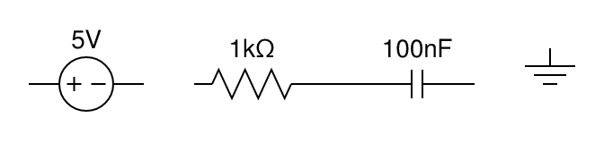
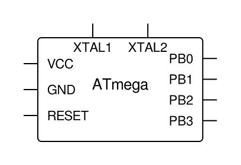
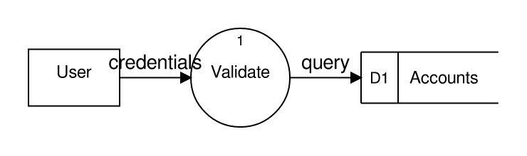
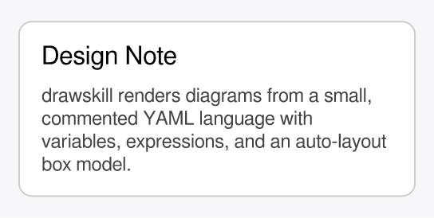

# drawskill

A [Claude](https://claude.com/claude-code) **skill** plus a companion command-line tool for
drawing diagrams. You (or Claude) describe a diagram in a small, commented **YAML** language;
`drawskill` lays it out automatically and renders it to **PNG**, **SVG**, or **PDF**.

- **Box-model auto-layout** (`vbox` / `hbox` / `box`) so you rarely place raw coordinates.
- **Variables + expressions**, including inline text measurement, so sizes aren't hand-computed.
- A **plugin system for symbol libraries** — ships with **schematic** (electronic) and
  **dataflow / DFD** symbols, including a generic IC with named pins.
- Mixes **semantic symbols** with **raw draw primitives** for fine-grained control.
- A single self-contained binary, no runtime dependencies.

---

## Installation

### Option 1 — Download a prebuilt binary (recommended)

Grab the latest release for your platform and put `drawskill` somewhere on your `PATH`:

> **Downloads:** _coming soon_ — `https://github.com/<owner>/drawskill/releases` *(placeholder; link to be filled in)*

```sh
# Example (Linux/macOS): after downloading and extracting the archive
chmod +x drawskill
sudo mv drawskill /usr/local/bin/
drawskill --help
```

### Option 2 — Build from source

`drawskill` is written in Rust and builds with Cargo — there are **no system libraries** to
install. Install the Rust toolchain via [`rustup`](https://rustup.rs), then:

```sh
cargo build --release
./target/release/drawskill --help
```

See [DEVELOPMENT.md](DEVELOPMENT.md) for detailed toolchain setup and the developer workflow.

---

## Usage

Render a diagram — the output format is inferred from the file extension (or set with
`--format`):

```sh
drawskill render diagram.yaml -o diagram.svg
drawskill render diagram.yaml -o diagram.png --scale 2   # higher-resolution PNG
drawskill render diagram.yaml -o diagram.pdf
```

Discover the available symbols and their properties:

```sh
drawskill symbols list
drawskill symbols describe schematic.resistor
```

Measure text up front (when you want exact sizes). Text is read from a **file**, never the
command line, so quotes, newlines, and shell metacharacters are never a problem:

```sh
drawskill measure --text-file label.txt --size 14                   # single line
drawskill measure --text-file paragraph.txt --size 14 --width 200   # wrapped paragraph
```

Query the fonts available on your system (drawskill uses your **system fonts**):

```sh
drawskill fonts list
drawskill fonts query --family "DejaVu Sans"
```

---

## Examples

Each example below is a commented `.yaml` file in [`examples/`](examples/), rendered with
`drawskill render`.

### Schematic — an RC low-pass filter

A horizontal row of two-terminal components with value labels and a wire connection.
([rc_filter.yaml](examples/rc_filter.yaml))



### Generic IC with named pins

The `schematic.ic` symbol auto-sizes to fit the chip name and pin labels; each pin becomes a
connectable port. ([ic_atmega.yaml](examples/ic_atmega.yaml))



### Data-flow diagram

DFD symbols (external entity, process, data store) connected with labeled, arrow-headed flows.
([dfd_login.yaml](examples/dfd_login.yaml))



### Auto-sized note card

Variables, inline text measurement (`para_height`), a `box` stack, and wrapped paragraph text
— the card's height is computed from its content. ([note_card.yaml](examples/note_card.yaml))



---

## The diagram language

Diagrams are a tree of auto-laid-out nodes (`vbox`/`hbox`/`box` containers, `symbol`s, `text`,
raw shapes) plus `connect`ions, with a `vars`/`${expression}` system that includes inline text
measurement. For example:

```yaml
# A box whose width fits its title.
vars:
  title: "Hello"
  pad: 12
canvas: { padding: 10, background: white }
root:
  box:
    - rect: { rx: 6 }
      width: ${text_width(title, 16) + pad * 2}
      height: 40
      fill: "#eef"
      stroke: "#88a"
    - text: ${title}
      font_size: 16
```

The full language reference and symbol catalog live in
[`skill/reference/`](skill/reference/). The two built-in symbol plugins are **schematic**
(resistor, capacitor, inductor, diode, voltage source, switch, ground, junction, and a generic
IC with named pins) and **dataflow** (process, external entity, data store, flow, trust
boundary).

> Tip: inside YAML **flow** mappings (`{ ... }`), quote expressions — `{ width: "${w}" }` —
> because the `}` would otherwise close the mapping. Block style needs no quoting.

---

## Using it as a Claude skill

The [`skill/`](skill/) directory contains the Claude skill (named `diagram`), with `SKILL.md`
and a `reference/` folder documenting the language and symbols. Once the `drawskill` binary is
on your `PATH`, install the skill by copying `skill/` into your Claude skills directory (e.g.
`~/.claude/skills/diagram/`). Claude will then discover symbols and fonts via the CLI, author
the commented YAML, measure text when needed, and render diagrams for you on request.

---

## Development

Building from source, the project layout, and the contributor workflow are documented in
[DEVELOPMENT.md](DEVELOPMENT.md).

## License

Licensed under the [Apache License, Version 2.0](LICENSE).
