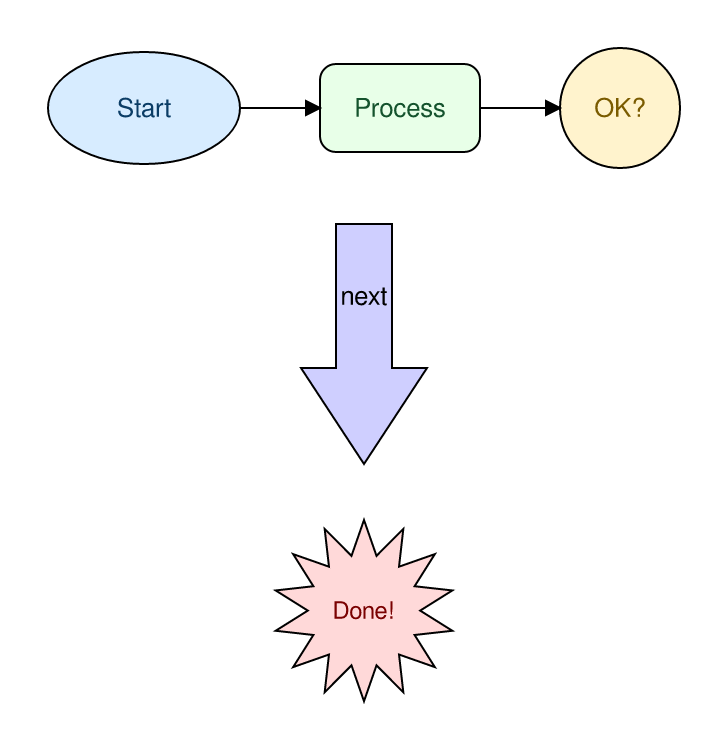

# diagram

A [Claude](https://claude.com/claude-code) **skill** plus a companion command-line tool for
drawing diagrams. You (or Claude) describe a diagram in a small, commented **YAML** language;
`diagram` lays it out automatically and renders it to **PNG**, **SVG**, or **PDF**.

- **Box-model auto-layout** (`vbox` / `hbox` / `box`) so you rarely place raw coordinates.
- **Variables + expressions**, including inline text measurement, so sizes aren't hand-computed.
- A **plugin system for symbol libraries** — ships with **schematic** (electronic),
  **dataflow / DFD**, and **shapes** (generic colored rectangles, circles, ovals, explosion
  callouts, and block arrows) symbols, including a generic IC with named pins.
- Mixes **semantic symbols** with **raw draw primitives** for fine-grained control.
- A single self-contained binary, no runtime dependencies.

---

## Installation

### Install the executable

On Linux or macOS, paste this into a terminal — `uname` picks the right file automatically:

```sh
curl -fsSL "https://github.com/jmoiv/diagram/releases/latest/download/diagram_$(uname -s)-$(uname -m).gz" \
  | gunzip > /usr/local/bin/diagram && chmod +x /usr/local/bin/diagram
```

> If `/usr/local/bin` is owned by root, prefix with `sudo sh -c '...'`.

On Windows, use the same command in **Git Bash** or **WSL** — both include `curl` and
`gunzip`. Or download [windows-x86_64.gz](https://github.com/jmoiv/diagram/releases/latest/download/windows-x86_64.gz)
and decompress it manually.

Direct links: [diagram_Linux-x86_64.gz](https://github.com/jmoiv/diagram/releases/latest/download/diagram_Linux-x86_64.gz) ·
[diagram_Linux-aarch64.gz](https://github.com/jmoiv/diagram/releases/latest/download/diagram_Linux-aarch64.gz) ·
[diagram_Darwin-x86_64.gz](https://github.com/jmoiv/diagram/releases/latest/download/diagram_Darwin-x86_64.gz) ·
[diagram_Darwin-arm64.gz](https://github.com/jmoiv/diagram/releases/latest/download/diagram_Darwin-arm64.gz) ·
[diagram_windows-x86_64.gz](https://github.com/jmoiv/diagram/releases/latest/download/diagram_windows-x86_64.gz)

To build from source instead, see [DEVELOPMENT.md](DEVELOPMENT.md).

### Keeping diagram up to date

```sh
diagram update
```

This checks the [latest release](https://github.com/jmoiv/diagram/releases) and, if a newer
version is available, downloads and replaces the running binary automatically. If `diagram`
is installed in a system directory, run with `sudo`.

### Install the Claude skill

diagram includes a companion Claude skill (named `diagram`) so Claude can draw diagrams for
you. The skill is embedded in the binary — install it with one command:

```sh
diagram install
```

This finds the right `.claude` directory and writes the skill to `.claude/skills/diagram/`.
It chooses the location by searching upward from the current directory:

1. if a `.claude` directory already exists (here or in a parent), the skill goes there;
2. otherwise, a new `.claude` is created next to the nearest `.git` (your repo root);
3. otherwise, it's created in the current directory.

Run it from inside a project to install the skill for that project, or from your home
directory (which typically already has `~/.claude`) to install it globally. After installing,
Claude will discover symbols and fonts via the CLI, author the commented YAML, measure text
when needed, and render diagrams for you on request.

---

## Usage

Render a diagram — the output format is inferred from the file extension (or set with
`--format`):

```sh
diagram render diagram.yaml -o diagram.svg
diagram render diagram.yaml -o diagram.png --scale 2   # higher-resolution PNG
diagram render diagram.yaml -o diagram.pdf
```

Discover the available symbols and their properties:

```sh
diagram symbols list
diagram symbols describe schematic.resistor
```

Measure text up front (when you want exact sizes). Text is read from a **file**, never the
command line, so quotes, newlines, and shell metacharacters are never a problem:

```sh
diagram measure --text-file label.txt --size 14                   # single line
diagram measure --text-file paragraph.txt --size 14 --width 200   # wrapped paragraph
```

Query the fonts available on your system (diagram uses your **system fonts**):

```sh
diagram fonts list
diagram fonts query --family "DejaVu Sans"
```

---

## Examples

Each example below is a commented `.yaml` file in [`examples/`](examples/), rendered with
`diagram render`.

### Schematic — an RC low-pass filter

A horizontal row of two-terminal components with value labels and a wire connection.
([rc_filter.yaml](examples/rc_filter.yaml))


### Generic IC with named pins

The `schematic.ic` symbol auto-sizes to fit the chip name and pin labels; each pin becomes a
connectable port. ([ic_atmega.yaml](examples/ic_atmega.yaml))


### Data-flow diagram

DFD symbols (external entity, process, data store) connected with labeled, arrow-headed flows.
([dfd_login.yaml](examples/dfd_login.yaml))


### Auto-sized note card

Variables, inline text measurement (`para_height`), a `box` stack, and wrapped paragraph text
— the card's height is computed from its content. ([note_card.yaml](examples/note_card.yaml))


### Generic shapes

The `shapes` plugin — colored rectangles, circles, ovals, an explosion callout, and a block
arrow, each with `fill` and `text_color`. ([shapes_flowchart.yaml](examples/shapes_flowchart.yaml))



---

## The diagram language

Diagrams are a tree of auto-laid-out nodes (`vbox`/`hbox`/`box` containers, `symbol`s, `text`,
raw shapes) plus `connect`ions, with a `vars`/`${expression}` system that includes inline text
measurement. For example:

```yaml
# A box whose width fits its title.
vars:
  title: "Hello"
  pad: 12
canvas: { padding: 10, background: white }
root:
  box:
    - rect: { rx: 6 }
      width: ${text_width(title, 16) + pad * 2}
      height: 40
      fill: "#eef"
      stroke: "#88a"
    - text: ${title}
      font_size: 16
```

The full language reference and symbol catalog live in
[`skill/reference/`](skill/reference/). The built-in symbol plugins are **schematic**
(resistor, capacitor, inductor, diode, voltage source, switch, ground, junction, and a generic
IC with named pins), **dataflow** (process, external entity, data store, flow, trust
boundary), and **shapes** (rectangle, circle, oval, explosion callout, block arrow).

> Tip: inside YAML **flow** mappings (`{ ... }`), quote expressions — `{ width: "${w}" }` —
> because the `}` would otherwise close the mapping. Block style needs no quoting.

---

## Development

Building from source, the project layout, and the contributor workflow are documented in
[DEVELOPMENT.md](DEVELOPMENT.md).

## License

Licensed under the [Apache License, Version 2.0](LICENSE).
